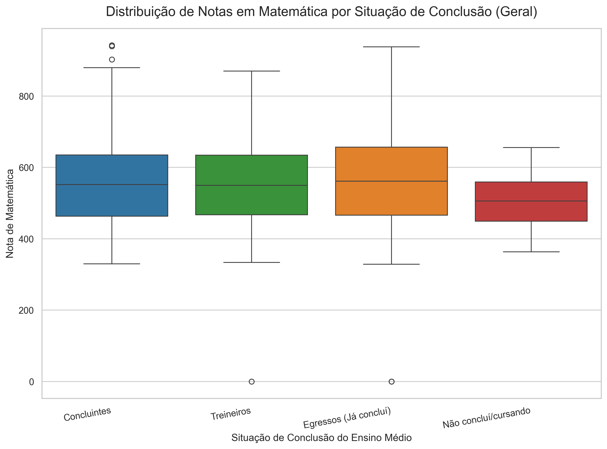
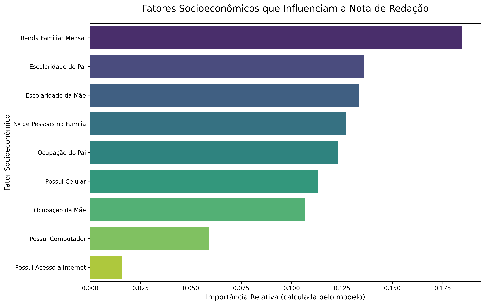

# Análise de Dados do ENEM em Campo Belo (2019-2023)


Este projeto consiste em uma análise aprofundada dos Microdados do Exame Nacional do Ensino Médio (ENEM) para o município de Campo Belo - MG, abrangendo o período de 2019 a 2023. O estudo foi desenvolvido como parte do programa de estágio na Secretaria Municipal de Educação, com o objetivo de aplicar técnicas de Ciência de Dados e Inteligência Artificial para extrair insights acionáveis sobre o perfil e o desempenho dos participantes.

---

## 🚀 Principais Descobertas e Resultados

A análise revelou um padrão consistente no perfil e desempenho dos participantes, além de identificar os fatores socioeconômicos de maior impacto nas notas através de um modelo de Machine Learning.

#### Perfil vs. Desempenho em Matemática
O gráfico abaixo demonstra a clara diferença de desempenho entre os perfis de participantes (Concluintes, Egressos e Treineiros), um padrão que se repete em todas as áreas do conhecimento.



#### Fatores de Maior Influência (Análise de IA)
Utilizando um modelo *Random Forest*, identificamos os principais fatores que influenciam a nota de Redação. A análise mostra a predominância de fatores ligados ao capital cultural e socioeconômico da família.



---

## 🛠️ Estrutura do Projeto

O projeto foi organizado de forma modular para garantir clareza e manutenibilidade:
```
projeto_enem/
│
├── dados_enem/             # (VAZIO) Local para os microdados brutos do INEP
├── dados_filtrados_campo_belo_mg/ # Armazena os arquivos CSV após a filtragem
├── imagens/                # Contém todos os gráficos gerados pela análise
├── scripts/                # Contém todo o código-fonte do projeto
│   ├── filtrar_enem_2019.py  # Scripts para filtrar os dados brutos (um por ano)
│   ├── ...
│   ├── utils.py              # Módulo com funções de apoio (carregar, decodificar)
│   ├── analise_exploratoria.py # Script para a análise descritiva e boxplots
│   └── analise_ia.py         # Script para a análise com Machine Learning
│
├── tabelas/                # Contém as tabelas de perfil exportadas em CSV/Excel
├── venv/                   # Ambiente virtual do Python (ignorado pelo Git)
├── .gitignore              # Arquivo para ignorar a pasta venv e outros
└── requirements.txt        # Lista de todas as dependências do projeto

```
---

## ⚙️ Como Executar o Projeto

Siga os passos abaixo para replicar a análise.

### Pré-requisitos
* Python 3.10 ou superior
* Git (para clonar o repositório)

### Passos para Instalação

1.  **Clone o repositório:**
    ```bash
    git clone [https://github.com/JulianoMata/analise_enem_campo_belo.git]
    cd projeto_enem
    ```

2.  **Crie e ative o ambiente virtual:**
    ```bash
    # Criar o ambiente
    python -m venv venv

    # Ativar no Windows (PowerShell)
    .\venv\Scripts\activate
    ```

3.  **Instale as dependências:**
    ```bash
    pip install -r requirements.txt
    ```

4.  **Baixe os Microdados do ENEM:**
    * Os arquivos de microdados brutos são muito grandes e não estão incluídos neste repositório.
    * Faça o download diretamente do portal do INEP: [link para os microdados](https://www.gov.br/inep/pt-br/acesso-a-informacao/dados-abertos/microdados/enem)
    * Descompacte e coloque os arquivos `.csv` de cada ano dentro da pasta `dados_enem/`, seguindo a estrutura esperada pelos scripts de filtragem (ex: `dados_enem/microdados_enem_2019/DADOS/MICRODADOS_ENEM_2019.csv`).

5.  **Execute a Pipeline de Análise:**
    * Os scripts devem ser executados na seguinte ordem:

    ```bash
    # 1. Execute os 5 scripts de filtragem
    python scripts/filtrar_enem_2019.py
    python scripts/filtrar_enem_2020.py
    # ... e assim por diante para 2021, 2022 e 2023

    # 2. Execute o script de análise exploratória
    python scripts/analise_exploratoria.py

    # 3. Execute o script de análise com IA
    python scripts/analise_ia.py
    ```
    * Ao final, todas as tabelas e gráficos serão gerados e salvos nas pastas `tabelas/` e `imagens/`.

---

## 📄 Fonte dos Dados
* **Instituto Nacional de Estudos e Pesquisas Educacionais Anísio Teixeira (INEP)** - [Microdados do ENEM](https://www.gov.br/inep/pt-br/acesso-a-informacao/dados-abertos/microdados/enem)

---

## 👨‍💻 Autor

* **Juliano França da Mata**
* **LinkedIn:** [julianomata](https://www.linkedin.com/in/julianomata/)
* **GitHub:** [JulianoMata](https://github.com/JulianoMata)